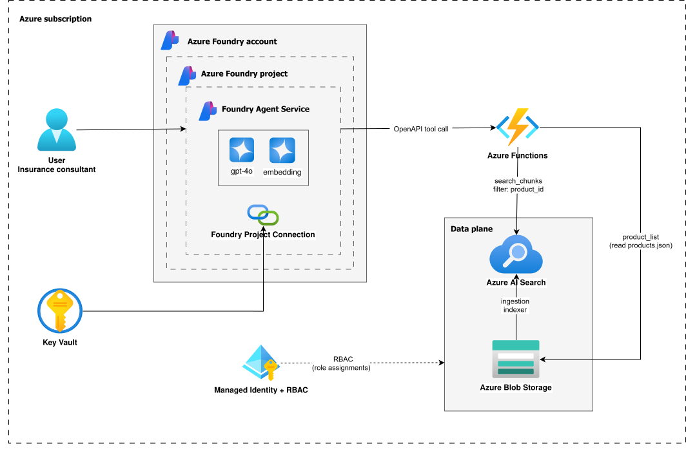
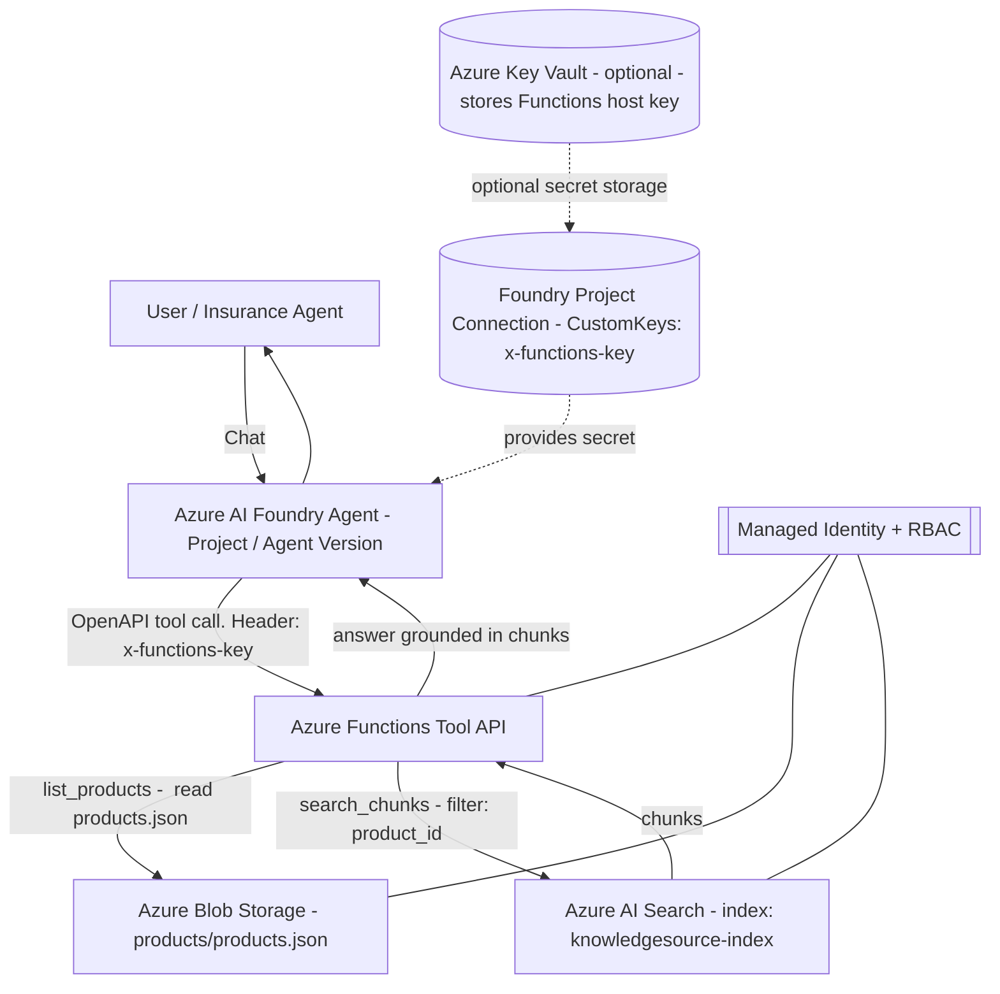
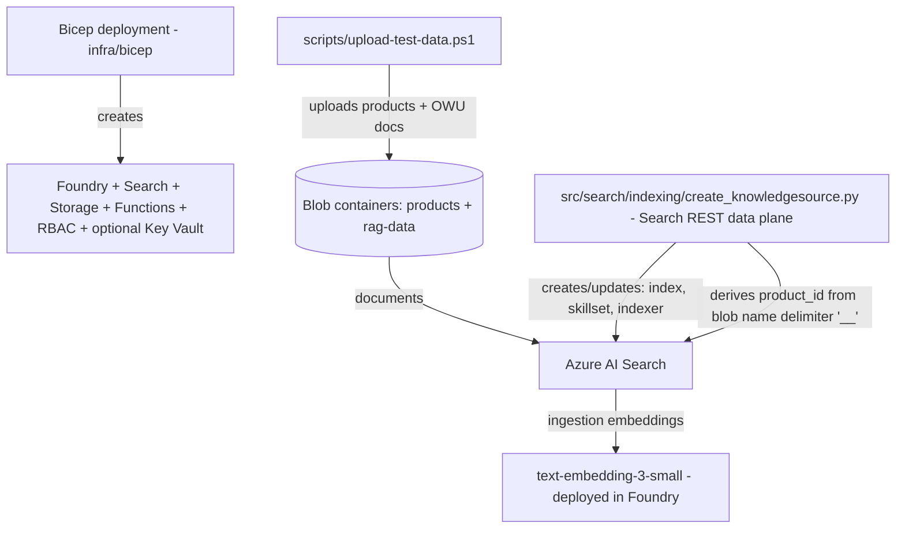
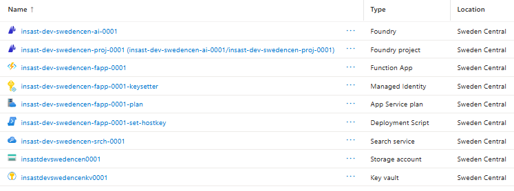
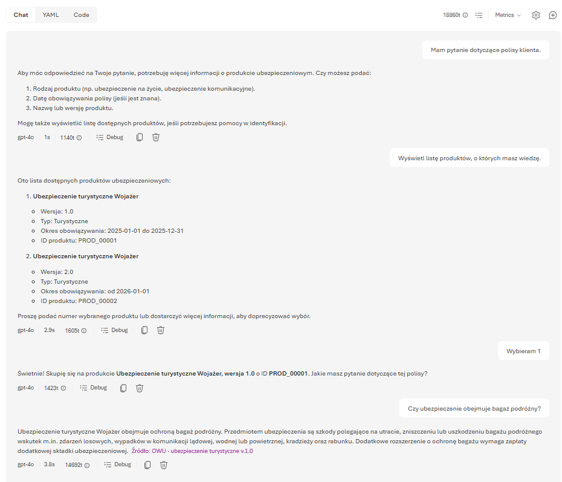

# azure-insurance-assistant

Insurance assistant built on **Azure AI Foundry** + **Azure AI Search (RAG)** with a deliberate safety constraint: **the assistant must select exactly one insurance product (and version) before it can retrieve policy chunks**.

The core goal is to support an insurance agent answering customer questions using the correct OWU/terms for a **specific product and validity period**, avoiding accidental cross-product leakage.

## Why this project (business)

In real insurance workflows, the same customer question (e.g., “Is water damage covered?”) has different answers depending on:

- product type (home/auto/etc.)
- product version (terms change over time)
- validity dates

This project demonstrates a practical approach to reduce “RAG mixing” risk by **forcing product context resolution first**, and only then allowing retrieval.

## What it does

From a user / agent perspective:

- Lists available products (including versions and validity dates).
- Enforces choosing exactly one `product_id` before any retrieval.
- Retrieves only chunks filtered by `product_id` from the RAG index.

From an engineering perspective:

- Exposes a minimal tool API via Azure Functions (OpenAPI).
- Uses **Managed Identity** (RBAC) for Functions → Storage/Search.
- Deploys infrastructure via **Bicep** and automates operational wiring (“single-secret” path).
- Includes tests validating endpoint behavior and the OpenAPI contract.

## What makes this different from “typical RAG”

Many RAG demos follow a simple pattern: embed the user question, retrieve the top-$k$ most similar chunks across the entire corpus, then ask the model to answer.

That approach is often *good enough* for broad knowledge bases, but it becomes risky in regulated domains (like insurance), where the same question can have different answers depending on product/version/date.

This project implements **product-gated retrieval**:

- **Hard gate before retrieval**: the assistant must resolve exactly one `product_id` first (otherwise it should ask follow-up questions or show candidate products).
- **Hard filter at query time**: retrieval uses an explicit `product_id` filter in Azure AI Search, so only chunks for the chosen product can be returned.

Why it matters:

- Reduces accidental cross-product mixing (“policy A” chunks used to answer questions about “policy B”).
- Makes the reasoning traceable: every answer is grounded in a specific product context.
- Aligns better with real insurance workflows (agents almost always operate on a specific polisa/OWU version).

Trade-offs (intentional):

- Requires maintaining a product catalog and a stable `product_id` strategy.
- Adds an extra step/turn when the product is ambiguous.
- Ingestion must preserve or derive `product_id` reliably (this repo demonstrates filename-based extraction as one option).

## High-level architecture

Runtime flow:

1. Azure AI Foundry agent receives a question.
2. The agent calls Azure Functions via an OpenAPI tool:
	 - `list_products` to resolve product context
	 - `search_chunks` to retrieve RAG chunks hard-filtered by `product_id`
3. Azure Functions access data-plane resources using Managed Identity:
	 - Azure Blob Storage for product catalog (`products.json`)
	 - Azure AI Search for retrieval

Key implementation files:

- Agent creation: [src/agent/create_agent.py](src/agent/create_agent.py)
- OpenAPI spec: [src/agent/assets/function_openapi.json](src/agent/assets/function_openapi.json)
- OpenAPI tool wiring: [src/agent/tools/function_openapi_tool.py](src/agent/tools/function_openapi_tool.py)
- Functions entrypoints: [src/functions/insurance-assistant-functions/function_app.py](src/functions/insurance-assistant-functions/function_app.py)

## Architecture diagram

High-level runtime architecture:



Mermaid diagrams:

- **Runtime**: how a question becomes a grounded answer (with the product gate).
- **Provisioning**: how IaC and ingestion prepare the data plane.

### Runtime (product-gated RAG)



### Provisioning (IaC + ingestion/data plane)




## Tech stack

- **Python 3.11**
- **Azure Functions** (Linux Consumption, Python)
- **Azure AI Foundry** (AI Services account + Project) and **Azure AI Projects SDK**
- **Azure AI Search** (RAG retrieval; plus ingestion/knowledge source provisioning)
- **Azure Storage (Blob)** for product catalog and RAG documents
- **Azure Key Vault** (optional; for storing the Functions host key secret)
- **Microsoft Entra ID / Managed Identity + RBAC**
- **Bicep** (infrastructure as code)
- **PowerShell automation** scripts for deploy/verify/test
- **OpenAPI** tool contract + **pytest** test suite

## Azure resources (IaC)

Infrastructure is defined in [infra/bicep/main.bicep](infra/bicep/main.bicep) and modularized in [infra/bicep/modules](infra/bicep/modules).

Provisioned components:

- Azure AI Foundry (AI Services account) + Project
- Model deployments:
	- `gpt-4o` (chat)
	- `text-embedding-3-small` (embeddings)
- Azure AI Search service
- Storage Account + blob containers:
	- `rag-data` (documents)
	- `products` (catalog)
- Azure Functions App (System Assigned Managed Identity)
- Optional Key Vault (to store the Functions host key as a secret)



## Security model

This project intentionally uses different mechanisms for different hops.

### Agent → Azure Functions (tool calls)

- Uses an Azure Functions key passed as `x-functions-key`.
- The key is stored in an Azure AI Foundry **Project Connection** of type **CustomKeys**.

Default connection expected by the agent script:

- Connection name: `con-function-insurance-assistance`
- Header name: `x-functions-key`
- Value: Function App → App keys → key named `default`

### Azure Functions → Storage / Search

- Uses `DefaultAzureCredential` (Managed Identity in Azure; developer credentials locally).
- RBAC assignments are deployed in [infra/bicep/modules/rbac.bicep](infra/bicep/modules/rbac.bicep).

### Search → Embeddings (for ingestion)

- Azure AI Search uses its managed identity to call the embeddings deployment (RBAC: *Cognitive Services OpenAI User*).

## RAG data organization (product isolation)

Data sources:

- Product catalog in Blob Storage (defaults: container `products`, blob `products.json`).
- RAG documents in Blob Storage (default: container `rag-data`).

Indexing strategy:

- Azure AI Search documents include a `product_id` field.
- The ingestion pipeline extracts `product_id` from the blob name (default delimiter `__`, configurable).
- Retrieval is always hard-filtered by `product_id` in the Functions endpoint.

Data-plane provisioning (Search knowledge source + mappings):

- Script: [src/search/indexing/create_knowledgesource.py](src/search/indexing/create_knowledgesource.py)
- Templates: [src/search/indexing/definitions](src/search/indexing/definitions)

## Quickstart (end-to-end)

Prerequisites:

- Python 3.11
- Azure CLI (`az`) and access to a subscription
- Azure Functions Core Tools (`func`) to publish/run Functions

### 1) Provision Azure infrastructure

Runs the Bicep deployment and assigns required RBAC to your signed-in user.

```powershell
./scripts/deploy.ps1
```

Optional: enable “single-secret wiring” by setting a Functions host key value up front:

```powershell
$env:FUNCTION_X_FUNCTIONS_KEY = "<your-secret>"
./scripts/deploy.ps1
```

When `FUNCTION_X_FUNCTIONS_KEY` is provided, the deployment:

- sets the Function App key named `default` to that value
- creates the AI Foundry Project Connection that stores the same value as `x-functions-key`

### 2) Publish Azure Functions code

```powershell
./scripts/deploy-functions.ps1
```

### 3) Upload sample data (optional)

Uploads:

- [test/test-data/products.json](test/test-data/products.json) → `products/products.json`
- all files under [test/test-data/OWU](test/test-data/OWU) → `rag-data/`

```powershell
./scripts/upload-test-data.ps1
```

### 4) Provision the Search knowledge source (data plane)

The indexing script uses Search REST APIs and needs environment variables (commonly via a `.env`).

See the header comment in [src/search/indexing/create_knowledgesource.py](src/search/indexing/create_knowledgesource.py) for the exact variables.

### 5) Create/update the agent

Environment variables used by [src/agent/create_agent.py](src/agent/create_agent.py):

- `AI_SERVICE_PROJECT_ENDPOINT`
- `FUNCTION_BASE_URL` (e.g., `https://<your-functionapp>.azurewebsites.net`)
- `FUNCTION_PROJECT_CONNECTION_NAME` (optional; defaults to `con-function-insurance-assistance`)

Then run:

```powershell
python ./src/agent/create_agent.py
```

Note: the agent instructions and responses are configured to be **Polish-language** (to match the OWU documents used in the sample data).

## Demo / testing in Foundry Portal (Playground)

You can test the agent end-to-end (including tool calls to Azure Functions) directly in the **Azure AI Foundry Portal**:

1. Open https://ai.azure.com and select your project.
2. Navigate to **Build** → **Agents**.
3. Open your agent and choose **Open in playground** / **Try in playground**.
4. Ask a question that requires product context (the agent should call `list_products` first, then `search_chunks`).

Example Playground chat showing a user question and the agent’s end-to-end behavior (including tool calls):



This is the fastest way to validate:

- the agent instructions (mandatory `product_id` resolution)
- the OpenAPI tool wiring and authentication (`x-functions-key` via Project Connection)
- the Functions tool behavior and retrieval filtering

## Publish to Microsoft Teams and Microsoft 365 Copilot (no custom adapter code)

In the **New Foundry** portal, an agent version can be published directly to **Microsoft Teams** and **Microsoft 365 Copilot** using the **Publish** button (as shown in the UI).

What this publishing flow does (high level):

- Creates an **agent application** with a stable endpoint.
- Automatically provisions the required Microsoft 365 packaging artifacts.
- Can create the required **Azure Bot Service** resource and Microsoft Entra ID app registration as part of the flow.

Typical steps:

1. In https://ai.azure.com open your agent version.
2. Select **Publish** → **Publish to Teams and Microsoft 365 Copilot**.
3. Provide required metadata (name/description/icons/publisher, privacy policy URL, terms of use URL).
4. Prepare the package, then either download it for testing (Teams → upload custom app) or continue the in-product publishing flow.

Important operational note (RBAC):

- A published agent application uses its **own identity**, separate from your project identity.
- If the agent uses tools that access Azure resources, you may need to **reassign RBAC** permissions so the published agent identity can access those resources.

References:

- Publishing to Teams and Microsoft 365 Copilot: https://learn.microsoft.com/azure/ai-foundry/agents/how-to/publish-copilot?view=foundry

### When you still need code

For advanced scenarios (custom logic, deeper auth/SSO flows, multi-environment deployment), you can integrate the Foundry agent with Microsoft 365 using a proxy app built with the **Microsoft 365 Agents Toolkit** rather than relying only on the portal publishing flow.

Reference overview: https://learn.microsoft.com/microsoft-365-copilot/extensibility/overview-custom-engine-agent

## Local development

### Run Functions locally

1. Fill required values in [src/functions/insurance-assistant-functions/local.settings.json](src/functions/insurance-assistant-functions/local.settings.json).
2. Start the host:

```powershell
cd ./src/functions/insurance-assistant-functions
func start
```

## Testing

Run the CI-friendly test suite:

```powershell
./scripts/test.ps1
```

The script creates/uses a local `.venv`, installs [requirements-dev.txt](requirements-dev.txt), and runs `pytest`.

## Repository structure

- [infra](infra): Bicep templates (control plane)
- [scripts](scripts): deployment, verification, cleanup, test data upload
- [src/agent](src/agent): agent creation + OpenAPI tool definition
- [src/functions/insurance-assistant-functions](src/functions/insurance-assistant-functions): tool endpoints (Functions)
- [src/search/indexing](src/search/indexing): Search data-plane provisioning and templates
- [test](test): unit/contract tests + sample data

## Notes / limitations

- Some Azure resource providers and API versions used in IaC are **preview** and may evolve.
- Azure AI Search in this template uses the `free` SKU for simplicity; real workloads typically require scaling up.
- This repo focuses on the “agent + tools + RAG isolation” backend pattern; it does not include a UI.
